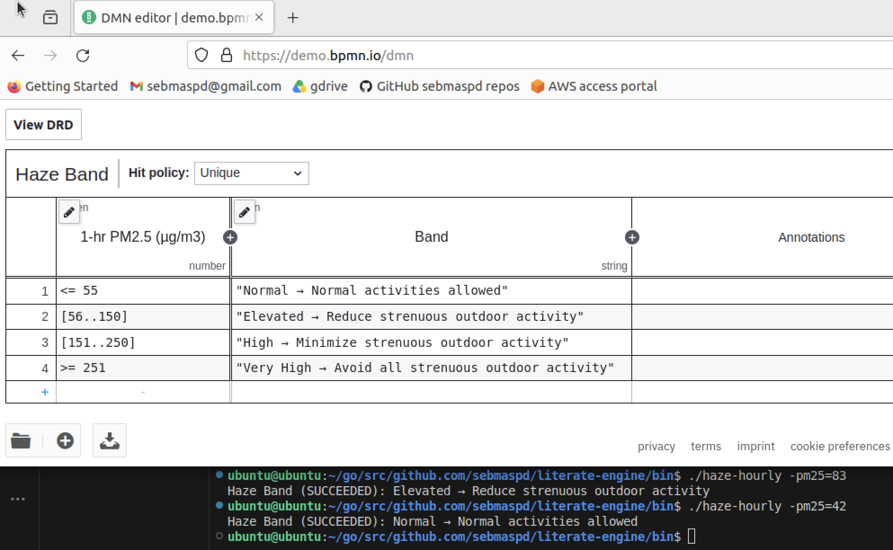

# Getting started with DMN

```sh
docker pull --platform linux/arm64 apache/incubator-kie-kogito-base-builder:10.0.x-20260322-linux-arm64
```

```sh
docker run -d -p 8080:8080 --name kogito-jit --platform linux/arm64 apache/incubator-kie-kogito-jit-runner:10.0.x-20260315-linux-arm64
```

## Prompts

1. in add directory, write Go program for a dmn rule to add to parameters a and b
2. in the directory haze-hourly, write a similar dmn based on Singapore PSI Haze Lookup Table and 1-Hour PM 2.5 Concentration Bands, the input would be the hourly pm 2.5
3. save my prompts to README.md
4. create a Makefile to build the Go binaries into /bin directory along with the dmn files
5. update the Makefile to also build binaries for linux/amd64 platform

## DMN on-line editor
To view or modify, load the `.dmn` file into `https://demo.bpmn.io/dmn`.  
 
